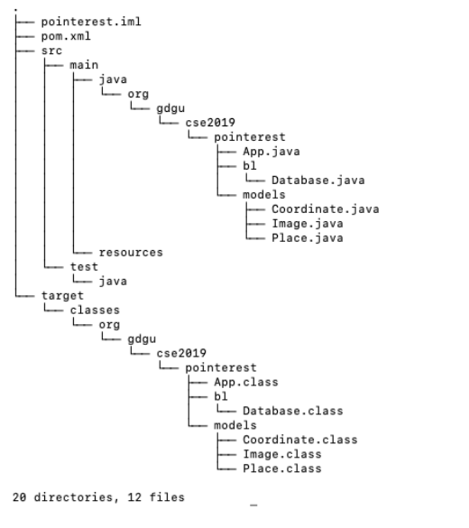
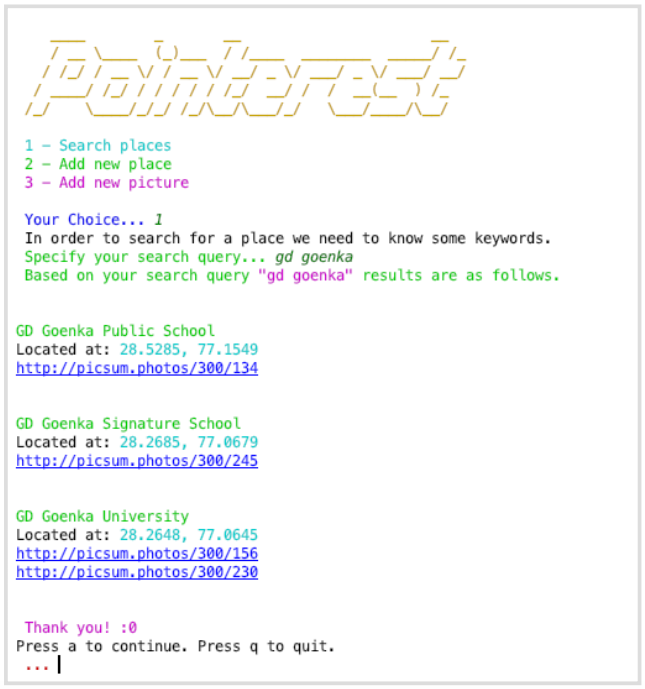
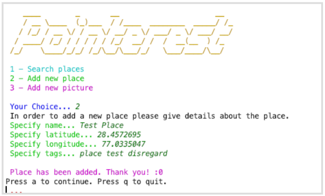
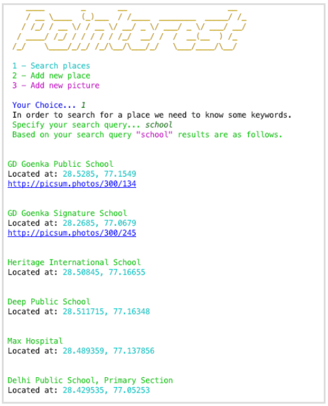
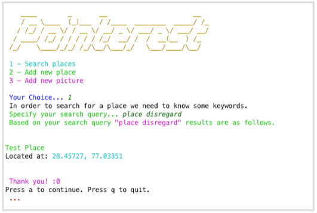
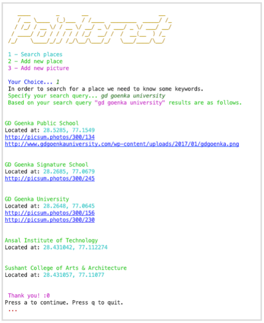
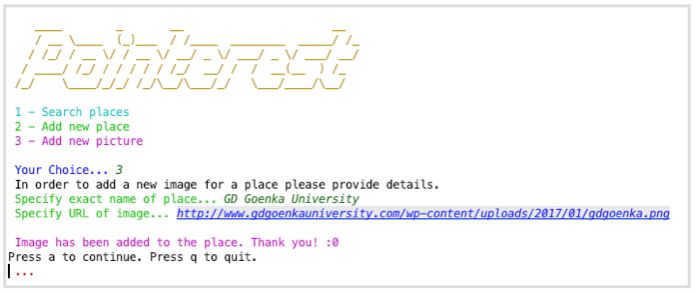

# Pointerest

A simple CLI application had been developed (as a part of lab work) that is able to search data from a MongoDB database which is used to store data about places and their respective images. Using the CLI application frontend one can also add new place or URL for a particular place. The application have been built using Java with the help of Java MongoDB driver. Some amount data about places in and around Gurgaon have also been extracted from the openly available data source Overpass API.

## Structure (Maven Project)

## Screenshots

