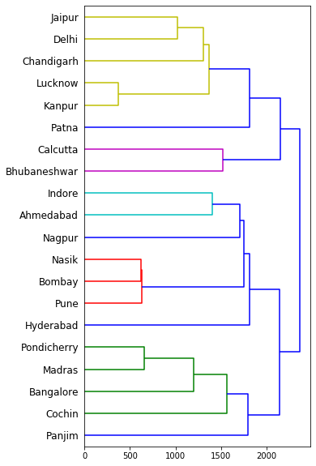

# Hierarchial Clustering of Indian Cities

Hierarchial clustering (also known as HCA or hierarchial cluster analysis) is an algorithm used to perfom cluster analysis on given data points based on affinities / similarity of each pair of data points. It seeks to build a hierarchy of clusters. In this example, we use an agglomerative (bottom-up) approach in case of which we use each observation to start in its own cluster and pairs of cluster are merged as we move up the hierarchy.

In our case, we use data points with a pre-computed matrix of distances between each of the data points. The distance matrix represnts the distances between various Indian cities based on data collected from http://www.lemuir.com/Assets/pdf/roaddistance.pdf. The results of the hierarchial clustering are represented in the form of a dendogram that helps visualise the complete hierarchy.

The source code used to perform the clustering and generate the dendogram can be found in this [notebook]("./Hierarchial_Clustering_of_Indian_Cities.ipynb").
